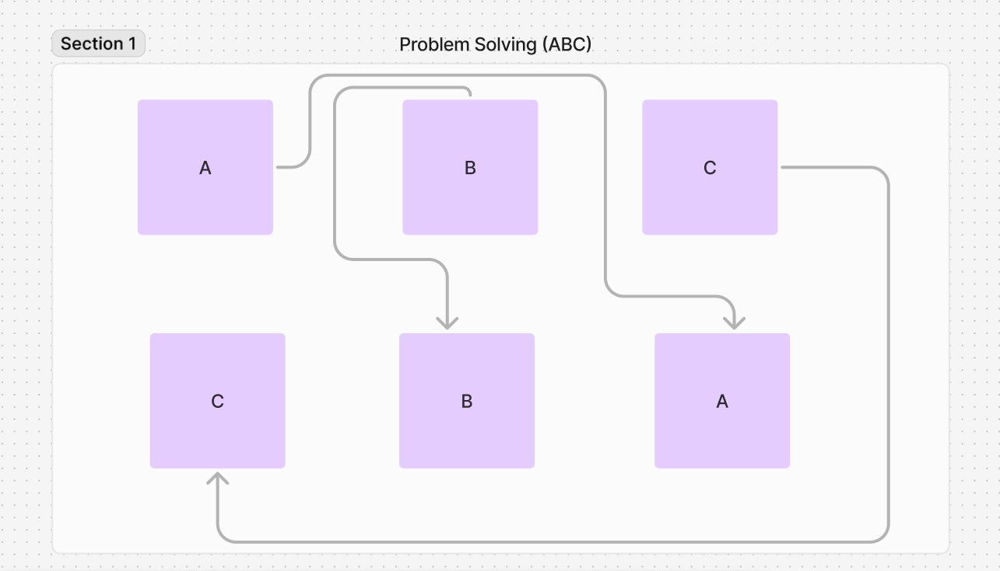

1. What are four websites where practice questions for coding interview can be found?

The four websites where practice questions can be found are https://leetcode.com, https://www.codewars.com, https://www.hackerrank.com, and https://projecteuler.net

2. What kind of question might be asked in a "Behavioral Interview"?

An interviewer might ask questions such as "What are your weaknesses?"

3. After reading this book review, would you like to read the book? Why or Why not?

Yes. It seems to contain valuable information on increasing the chances of a successful interview.

4. What are the two different kinds of data types in computer science?

The two different kinds of data structures in computer science are primitive data structures and abstract data structures.

5. Give one example of an ALGORITHM mentioned in the reading.

A cooking recipie is an example of an algorithm.

6. Why is it important to know about data structures and algorithms?

Data structures are essential ingredients in creating fast and powerful algorithms, and algorithms are fundamental to computer programming as they provide step-by-step instructions for executing tasks.

7. Draw a diagram of the ABC problem on paper. Try and solve it. If you can solve it, take a photo of your notes and post it. If you can't solve it, take a photo of your notes, as well. (You don't need to spend more than 15 minutes trying to solve it.)

8. What is one “Wishful Thinking” or “What if” question you could ask about the ABC problem?

"What if the A, B, and C blocks were in different positions?"

9. Of the 10 problem solving strategies listed in the reading, which do you feel will be the MOST useful? Why?

I feel that "Try something!" is the most useful.  It's important to mess around with a problem and tackle it from different angles.  This will help you get a better understanding of the problem.

10. Of the 10 problem solving strategies listed in the reading, which do you feel will be the LEAST useful? Why?

I feel that "Wishful thinking" is the least useful.  While it's a good strategy for getting started, you will still have to return to the original problem at some point.
